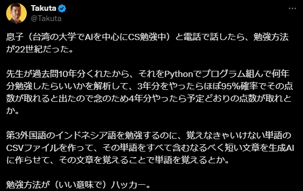

# **村上琢太**(タクタ)さんのストーリーを使って、簡単なN4レベルの日本語単語で例文を作る機能を実現しましょう。

From Takuta :
息子（台湾の大学でAIを中心にCS勉強中）と電話で話したら、勉強方法が22世紀だった。

先生が過去問10年分くれたから、それをPythonでプログラム組んで何年分勉強したらいいかを解析して、3年分をやったらほぼ95％確率でその点数が取れると出たので念のため4年分やったら予定どおりの点数が取れとか。

第3外国語のインドネシア語を勉強するのに、覚えなきゃいけない単語のCSVファイルを作って、その単語をすべて含むなるべく短い文章を生成AIに作らせて、その文章を覚えることで単語を覚えるとか。

勉強方法が（いい意味で）ハッカー。
